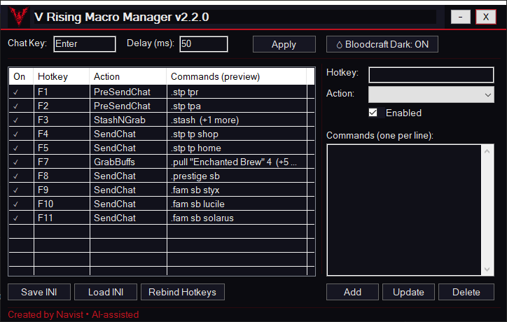

# V Rising Macro Manager (Bloodcraft UI)

A Bloodcraft-themed AutoHotkey v2 macro manager for V Rising that lets players create and manage hotkey-driven chat macros.

## Features

- GUI to add, update, and delete hotkey bindings
- Multiple action types: `SendChat`, `PreSendChat`, `StashNGrab`, `GrabBuffs`
- Bloodcraft (dark) and Light theme toggle
- INI-based configuration persistence
- Duplicate hotkey detection with visual highlighting
- System tray icon with version tooltip

## UI Preview

### Dark Mode

  

### Light Mode

  

## Requirements

- AutoHotkey v2  
  https://www.autohotkey.com/v2/

## Installation

1. Install **AutoHotkey v2**
2. Download or clone this repository
3. Run `V_Rising_Macro_Manager.ahk`

## Usage

Launch the script and configure hotkeys through the GUI.

Bindings are saved automatically to:
vrising_macros.ini

## Notes

- The default configuration file `vrising_macros.ini` is ignored by git.
- You can safely delete it to reset all bindings.
