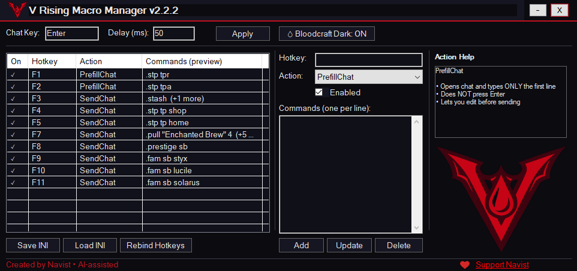
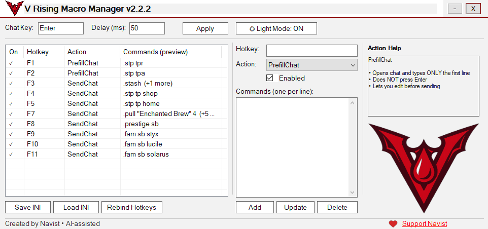

# V Rising Macro Manager (Bloodcraft UI)

A **GUI-based macro manager built with AutoHotkey v2 for V Rising**, designed to streamline chat commands and frequently used in‑game actions through customizable hotkeys.

The tool provides a clean **Bloodcraft‑inspired interface** that allows players to **create, organize, and trigger macros without editing scripts manually**.

---

# Overview

The **V Rising Macro Manager** allows players to bind macros to hotkeys and execute in‑game actions instantly.

Instead of maintaining raw scripts, users can manage their macros through an intuitive graphical interface with persistent configuration.

The application stores macro data in configuration files and automatically loads bindings when the program starts.

---

# Features

## Macro Management

- Create and assign macros to custom hotkeys
- Edit or remove existing macro bindings
- Persistent macro storage using configuration files
- Duplicate hotkey detection

---

## Profiles (NEW in v2.5.0)

The **Profile System** allows users to maintain multiple macro setups and switch between them instantly.

Examples:

- Different profiles for **different V Rising servers**
- Separate profiles for **PvE / PvP**
- Custom setups for **different characters or playstyles**

Each profile stores:

- Hotkeys
- Macro actions
- Chat key settings
- UI preferences

Profiles can be switched instantly from the interface.

---

## Macro Action Types

### SendChat

Sends a message directly to in‑game chat.

Example:
/unstuck

### PrefillChat

Opens the chat box and pre‑fills a command for manual confirmation.

Example:
/tp castle

_(Additional macro types may be added depending on server or mod environment.)_

---

# User Interface

- Bloodcraft themed **Dark Mode**
- Optional **Light Mode**
- Contextual **Action Help Panel**
- Organized macro listing and editing
- Instant **Profile Switching**

---

# Hotkey Safety

The macro manager prevents common input issues:

- Duplicate hotkey detection
- Visual conflict warnings
- Safer macro activation

---

# Quality of Life

- Automatic configuration saving
- Profile‑based macro organization
- System tray integration
- Tooltip and UI feedback for actions
- Easy hotkey editing from the GUI

---

# UI Preview

| Dark Mode                                           | Light Mode                                           |
| --------------------------------------------------- | ---------------------------------------------------- |
|  |  |

---

# Requirements

- Windows
- AutoHotkey v2

Download AutoHotkey:
https://www.autohotkey.com/v2/

---

# Installation

Install AutoHotkey v2

Clone or download the repository

git clone https://github.com/Navist/VRisingMacroManager.git

Run the script

V_Rising_Macro_Manager.ahk

---

# Configuration

Macro settings are stored automatically.

## Profile Structure

profiles/
Default.ini
PvP_Server.ini
PvE_Server.ini

The application remembers the last selected profile.

---

# Intended Use

This tool simplifies **repetitive chat commands and quality‑of‑life actions** while playing **V Rising**, particularly on servers with custom commands or modded functionality.

It **does not automate gameplay mechanics** or interact with game memory.

---

# License

This project is provided **as‑is for community use**.
